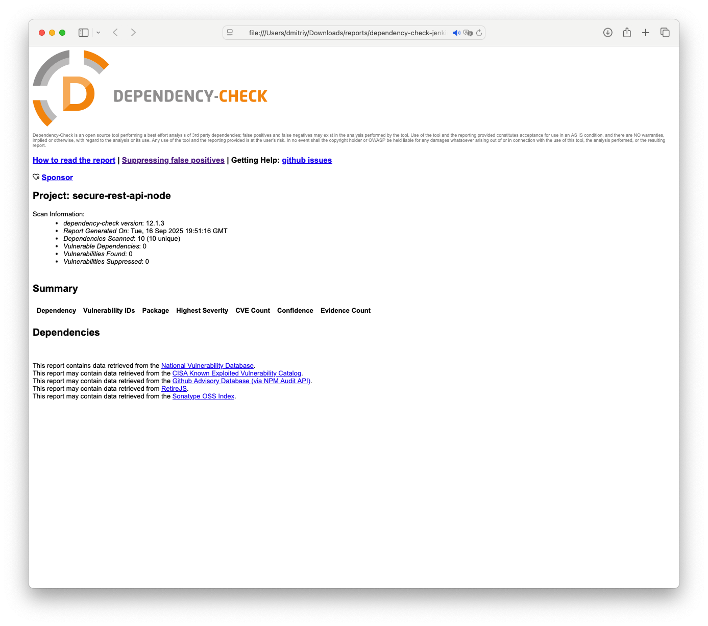
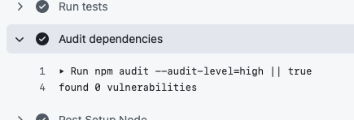

# Лабораторная работа #1

* Стек: **Node.js + Express**, **PostgreSQL**, **JWT**, **bcrypt**
* Безопасность: защита от **SQLi**, **XSS**, корректная **аутентификация** и **авторизация**, ограничение запросов, безопасные заголовки
* CI/CD: **GitHub Actions** — линт, тесты, SAST/SCA (ESLint+security, npm audit, OWASP Dependency-Check).


## API

Base URL по умолчанию: `http://localhost:8080`

### Аутентификация

`POST /auth/login` → `200 OK`
Тело (JSON):

```json
{ "username": "admin", "password": "Admin123!" }
```

Ответ:

```json
{
  "token": "<JWT>",
  "user": { "id": 1, "username": "admin" }
}
```

Передавайте `Authorization: Bearer <JWT>` в защищённых методах.

### Работа с объектами (одно текстовое поле `data`) — **требуется JWT**

#### Список

`GET /api/data` → `200 OK`

```json
[
  { "id": 1, "data": "текст", "created_at": "...", "updated_at": "..." }
]
```

#### Создать

`POST /api/data` → `201 Created`
Тело:

```json
{ "data": "любой текст" }
```

#### Удалить

`DELETE /api/data/:id` → `204 No Content`

**Коды ошибок:** `400` (валидация/плохой id), `401` (нет или неверный токен), `404` (не найдено).

#### Примеры curl

```bash
# аутентификация
TOKEN=$(curl -s -X POST http://localhost:8080/auth/login \
  -H "Content-Type: application/json" \
  -d '{"username":"admin","password":"Admin123!"}' | jq -r .token)

# создать запись
curl -s -X POST http://localhost:8080/api/data \
  -H "Authorization: Bearer $TOKEN" \
  -H "Content-Type: application/json" \
  -d '{"data":"Привет <script>alert(1)</script> мир"}' | jq

# получить список
curl -s http://localhost:8080/api/data -H "Authorization: Bearer $TOKEN" | jq

# удалить
curl -i -X DELETE http://localhost:8080/api/data/1 -H "Authorization: Bearer $TOKEN"
```

---

## Реализованные меры защиты

### Защита от SQL Injection

* Используются **параметризованные запросы** библиотеки `pg`:

  ```sql
  SELECT ... FROM users WHERE username = $1
  ```

  Никакой конкатенации строк для SQL.

### Защита от XSS

* **Серверная санитизация** поля `data` (и имени пользователя в ответе) при записи и при отдаче через библиотеку `xss` (вырезаются `<script>/<style>` и их содержимое).
* API возвращает **только JSON**, не рендерит HTML.
* Подключён `helmet` — безопасные заголовки (например, `X-Content-Type-Options: nosniff`). 

### Аутентификация и авторизация (Broken Auth/Access Control)

* Пароли хэшируются **bcrypt**, в базе нет открытых паролей.
* JWT (**HS256**) с **issuer**, **audience**, **expiresIn**. Токен выдаётся в `/auth/login`.
* Middleware `requireAuth` проверяет **Bearer JWT** на всех защищённых маршрутах.
* На ошибки аутентификации/авторизации возвращаются стандартные коды (`401`, `403`), без утечки лишних сведений.


## Схема БД

Создаётся автоматически (см. `src/sql/init.sql`):

* `users(id, username UNIQUE, password_hash, created_at)`
* `items(id, data, created_at, updated_at)`


---

## CI/CD: проверки безопасности и качество кода

Пайплайны запускаются на **push** и **pull request**:

* **`.github/workflows/ci.yml`**

  * `npm ci` → `eslint` (включая `eslint-plugin-security`) → `npm test` → `npm audit`
* **`.github/workflows/owasp-depcheck.yml`** — **OWASP Dependency-Check** (SCA)
  Генерирует отчёты (HTML/JSON/SARIF), публикует артефакты и, при наличии SARIF, выгружает в **Security → Code scanning alerts**

### Отчеты



Отчет OWASP в HTML виде




Результат `npm audit`
